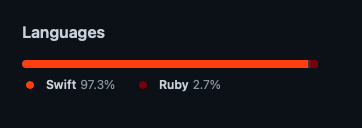

# Docket

A task management app which precisely increases the effeciency of the user significantly by helping in managing tasks around effectively and smoothly by eliminating the scope of the state of denial due to forgotten tasks or subtasks.

## Programming Languages/Tech Stack used

### Tech Stack and Dependencies

#### Swift 5
#### CocoaPods
#### RealM by MongoDB
#### Swipe cell kit
#### Chameleon framework

## Author
- [Ashmit Shukla](https://github.com/AshmiShukla)
